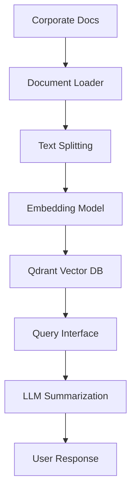

# KARMA  
**Knowledge Augmentation & Retrieval Management Assistant**  
*A friendly AI assistant for corporate knowledge enhancement*  

---

## 📖 Project Description  
**KARMA** is a Proof of Concept (POC) designed to revolutionize corporate knowledge management using modern **Retrieval-Augmented Generation (RAG)** architectures and **Large Language Models (LLMs)**. The goal is to ingest unstructured corporate documents (e.g., PDFs, Word files, emails), process and store them in a vector database, and enable intelligent, context-aware retrieval of information. Users can query the system in natural language, and KARMA leverages LLMs to deliver concise, accurate, and actionable summaries sourced directly from the corporate knowledge base.

---

## 🛠️ Tech Stack  
- **Core Language**: Python  
- **RAG Framework**: LangChain  
- **LLM Integration**: HuggingFace Transformers (e.g., FLAN-T5, BERT)  
- **Vector Database**: Qdrant  
- **API Layer**: FastAPI  
- **Infrastructure**: Docker, Terraform  
- **CI/CD**: GitLab CI  

---

## ✨ Key Features  
- **Document Ingestion**: Bulk upload and process unstructured corporate documents (PDF, DOCX, TXT).  
- **Vector Embeddings**: Convert text into embeddings using state-of-the-art models.  
- **Semantic Search**: Retrieve contextually relevant documents via natural language queries.  
- **LLM-Powered Summarization**: Generate concise answers using retrieved documents and LLMs.  
- **API-First Design**: Integrate with corporate workflows via RESTful endpoints.  

---

## 🚀 Installation  
### Prerequisites  
- Python 3.9+  
- Docker and Docker Compose  
- Terraform (for cloud deployment)  

### Setup  
1. Clone the repository:  
   ```bash  
   git clone https://gitlab.com/your-org/karma.git  
   cd karma  
   ```  

2. Install dependencies:  
   ```bash  
   pip install -r requirements.txt  
   ```  

3. Start services with Docker Compose (Qdrant + API):  
   ```bash  
   docker-compose up -d  
   ```  

---

## ⚙️ Configuration  
1. Set environment variables in `.env`:  
   ```ini  
   HF_API_TOKEN="your_huggingface_token"  
   QDRANT_URL="http://qdrant:6333"  
   DOCUMENTS_DIR="./data/documents"  
   ```  

2. Place corporate documents in the `./data/documents` directory.  

---

## 🧠 Usage  
### 1. Ingest Documents  
```bash  
python src/ingest.py --dir ./data/documents  
```  

### 2. Query via CLI  
```bash  
python src/query.py --query "What is our Q4 sales strategy?"  
```  

### 3. Use the FastAPI Endpoints  
- **Upload Documents**: `POST /upload`  
- **Search**: `POST /query`  
- **Summarize**: `GET /summarize?query=...`  

Access the API docs at `http://localhost:8000/docs`.  

---

## 🌐 Deployment  
### Docker  
```bash  
docker build -t karma-api .  
docker run -p 8000:8000 --env-file .env karma-api  
```  

### Terraform (AWS/GCP/Azure)  
```bash  
terraform init  
terraform apply -var="huggingface_token=$HF_API_TOKEN"  
```  

### GitLab CI Pipeline  
Pre-configured for:  
- Automated testing  
- Container registry builds  
- Cloud deployment  

---

## 📊 Architecture Diagram  


---

## 🤝 Contributing  
1. Fork the repository.  
2. Create a feature branch: `git checkout -b feature/your-idea`.  
3. Submit a merge request.  

---

## 📜 License  
MIT License. See [LICENSE](LICENSE).  

---

## 📧 Contact  
For support or collaboration, reach out to: [your.email@company.com](mailto:your.email@company.com)  
```